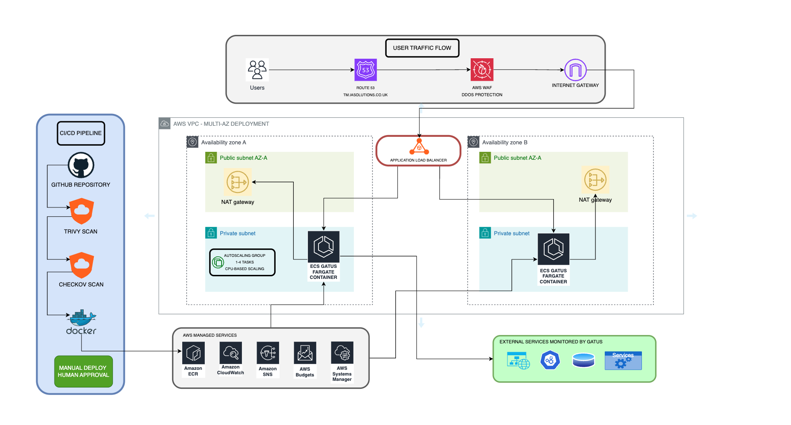
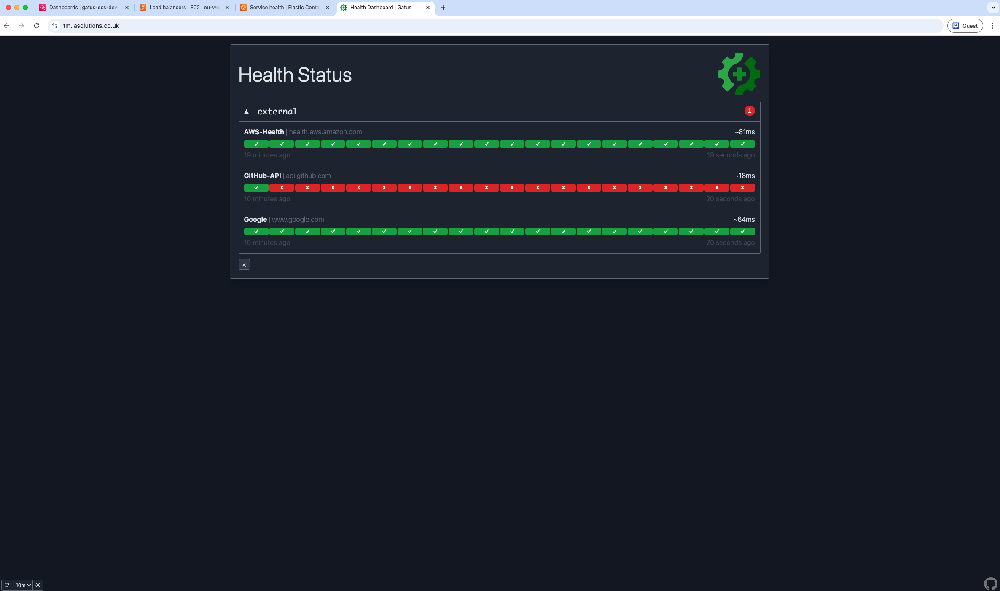
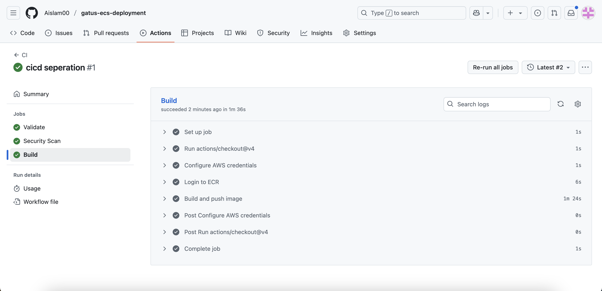
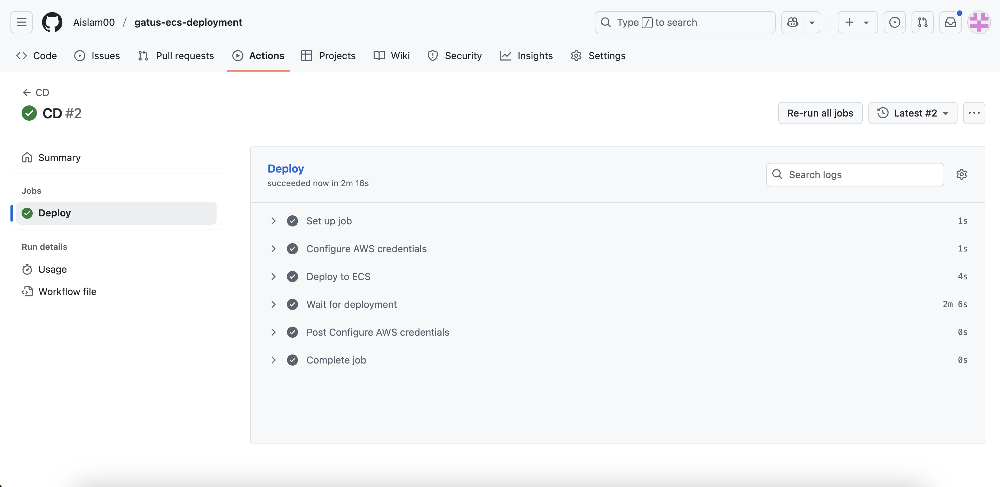
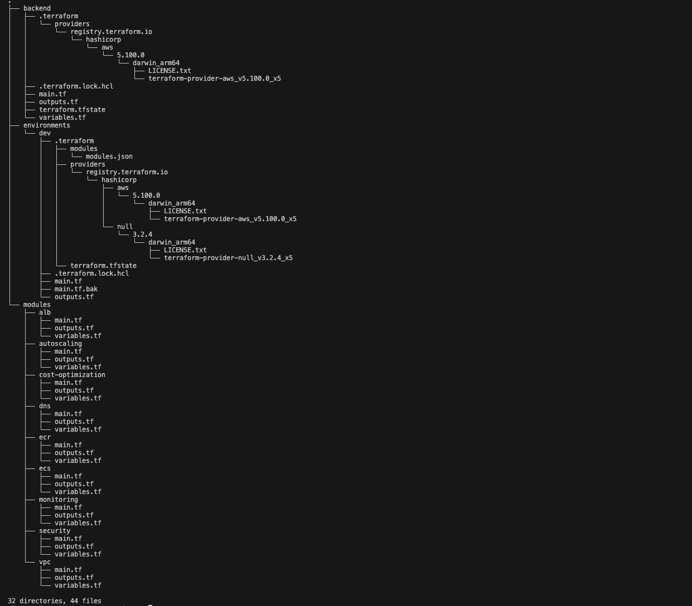
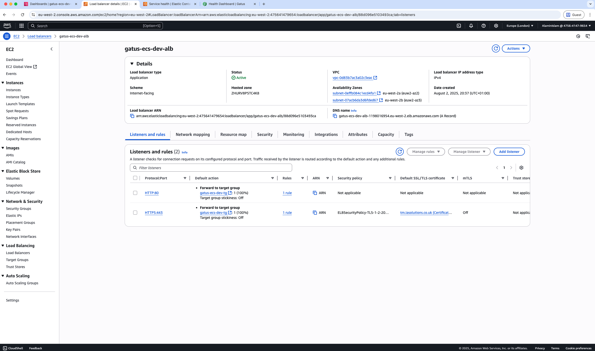
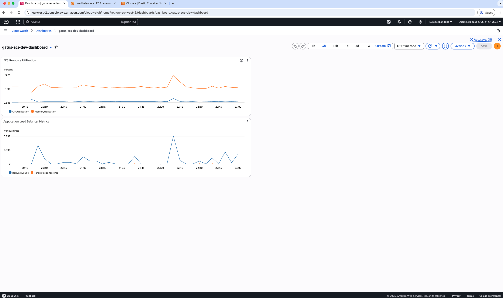

# Gatus ECS Deployment

**Tech Stack:** Terraform, AWS (ECS, ALB, Route53, CloudWatch, WAF), GitHub Actions, Docker, Gatus

A containerized monitoring platform deployed on AWS ECS Fargate that tracks external APIs and services with enterprise-grade CI/CD automation.

**Live Application:** https://tm.iasolutions.co.uk

## Author

**Alamin Islam**  
💼 LinkedIn: [linkedin.com/in/alamin-islam-58a635300](https://www.linkedin.com/in/alamin-islam-58a635300)  
🌐 Portfolio: [github.com/Aislam00](https://github.com/Aislam00)

## What it does

This project uses Gatus (an open-source health checker) to monitor external services. It runs on AWS ECS Fargate and automatically scales based on demand. The whole infrastructure is built with Terraform modules so it's easy to replicate.

The platform does HTTP health checks every few minutes and shows the results on a clean dashboard. Pretty useful for keeping track of service dependencies.

## Security Features

Production-ready security measures:
- **Container vulnerability scanning** - Trivy scans Docker images for known security vulnerabilities
- **Network isolation** - Containers run in private subnets with no direct internet access
- **WAF protection** - AWS WAF blocks common web attacks and implements rate limiting
- **HTTPS enforcement** - All traffic encrypted with automatic SSL certificate management
- **Least privilege IAM** - Each service gets only the minimum permissions required

## How to deploy

Deploy the Terraform backend:
```bash
cd terraform/backend
terraform init
terraform apply
```

Deploy the main infrastructure:
```bash
cd ../environments/dev
terraform init
terraform plan
terraform apply
```

The GitHub Actions pipeline handles container builds and deployments automatically when you push to main. Make sure to add your AWS credentials as GitHub secrets first.

## Architecture



**Key Components:**
- **ECS Fargate** - Runs containers without managing servers
- **Application Load Balancer** - Handles SSL and distributes traffic  
- **VPC** - Multi-tier network setup with private subnets
- **Auto Scaling** - Scales from 1-4 containers based on CPU usage
- **WAF** - Basic protection against common attacks
- **CloudWatch** - Monitoring and alerting

## Live Application



The deployed Gatus monitoring platform showing real-time health checks of external services and APIs.

## CI/CD Pipeline

Professional separation of concerns with dedicated CI and CD workflows:

### Continuous Integration (CI)


**CI Pipeline** runs automatically on every push and includes:
- **Validation Stage** - Terraform code format checking and configuration validation
- **Security Stage** - Trivy vulnerability scanning of container images
- **Build Stage** - Docker image building and pushing to Amazon ECR

### Continuous Deployment (CD)


**CD Pipeline** triggers after successful CI completion but requires manual approval:
- **Environment Protection** - Manual approval gate for production deployments
- **Deployment** - Updates ECS service with new container image
- **Health Checks** - Waits for deployment stability confirmation

The approval gate ensures deployments happen only after human review, following enterprise best practices for production safety.

## Infrastructure & Operations

### Terraform Structure


Modular infrastructure design with separate modules for networking, compute, security, and monitoring components.

### ECS Service Configuration


Production ECS Fargate service running with proper health checks and auto-scaling configuration.

### Load Balancer Setup


Application Load Balancer configured with SSL termination and health check endpoints.

### CloudWatch Monitoring


Cloudwatch monitoring dashboard tracking container metrics, application performance, and infrastructure health.

## Project Overview

This is a full end-to-end project demonstrating enterprise-grade AWS containerized infrastructure with Infrastructure as Code, automated CI/CD pipelines with approval gates, security scanning, and production monitoring. The platform showcases real-world ECS Fargate operations with proper deployment controls and comprehensive observability for external service monitoring.

The CI/CD implementation follows industry best practices with separated build and deployment workflows, ensuring code quality through automated testing while maintaining deployment safety through manual approval processes.