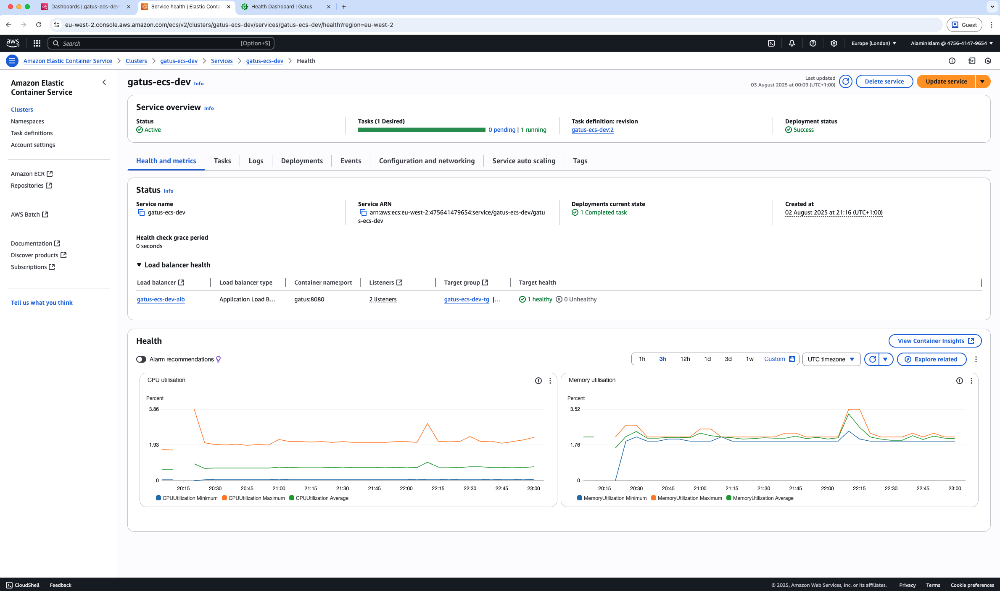

# Gatus ECS Monitoring Platform
Containerized health monitoring platform running on AWS ECS Fargate with automated deployments and security scanning.

## Table of Contents
- [Overview](#overview)
- [Tech Stack](#tech-stack)
- [Architecture](#architecture)
- [Live Application](#live-application)
- [Security Features](#security-features)
- [Pipeline in Action](#pipeline-in-action)
- [Monitoring & Operations](#monitoring--operations)
- [Key Features](#key-features)
- [Getting Started](#getting-started)
- [How to Use](#how-to-use)

## Overview
Production monitoring platform that tracks external APIs and services using **Gatus** (open-source health monitoring tool). Runs on AWS ECS Fargate with automatic scaling and complete CI/CD pipeline. Infrastructure is fully automated through Terraform.

**Live monitoring:** https://tm.iasolutions.co.uk

## Tech Stack
**AWS Infrastructure**
- ECS Fargate for serverless containers
- Application Load Balancer with SSL termination
- VPC with multi-tier networking
- ECR for container registry
- Route53 for DNS management

**Application**
- Gatus (open-source monitoring)
- Docker containerization
- Auto-scaling based on demand

**Security & Monitoring**
- AWS WAF for protection
- CloudWatch for metrics and alerting
- Trivy for vulnerability scanning

**Automation**
- GitHub Actions for CI/CD
- Terraform for infrastructure

## Architecture
**Infrastructure Overview**


**Terraform Module Structure**


## Live Application


## Security Features
**Container Security**
- Vulnerability scanning with Trivy on every build
- Containers run in private subnets with no direct internet access
- Least privilege IAM roles for all services

**Network Security**
- AWS WAF protection against common web attacks
- Security groups with restrictive firewall rules
- HTTPS enforcement with automatic certificate management

## Pipeline in Action

**Infrastructure Validation**


**ECS Deployment**


## Monitoring & Operations

**Load Balancer Configuration**


**CloudWatch Monitoring**


## Key Features
- **Serverless containers** - ECS Fargate eliminates server management
- **Auto-scaling** - Scales from 1-4 containers based on CPU usage
- **Security scanning** - Trivy scans every container build for vulnerabilities
- **Multi-tier networking** - Proper separation with private subnets
- **WAF protection** - Built-in protection against common attacks
- **Infrastructure as code** - Everything deployed via Terraform modules

## Getting Started

You'll need:
- AWS account with CLI configured
- Terraform installed
- Docker for local testing

```bash
# Get the code
git clone https://github.com/[your-username]/gatus-ecs-project.git
cd gatus-ecs-project

# Deploy backend first
cd terraform/backend
terraform init
terraform apply

# Deploy the infrastructure
cd ../environments/dev
terraform init
terraform apply
```

## How to Use

```bash
# Check ECS service status
aws ecs describe-services --cluster gatus-cluster --services gatus-service

# View container logs
aws logs tail /ecs/gatus --follow

# Scale the service manually
aws ecs update-service --cluster gatus-cluster --service gatus-service --desired-count 3
```

The GitHub Actions pipeline automatically builds and deploys when you push to main.

## Notes

This project demonstrates containerized applications on AWS without managing servers. The monitoring setup provides visibility into both application and infrastructure performance.